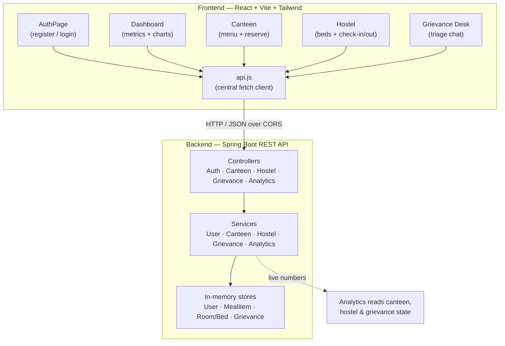

# SustainIQ

**A smart campus resource management platform for the University of Ruhuna, Sri Lanka.**

SustainIQ helps students reserve canteen meals (cutting food waste), check live hostel bed availability, manage hostel check-in / check-out, and raise grievances through an intelligent support desk — while giving campus administration a live analytics view of resource usage.

---

## Problem statement

At the University of Ruhuna, everyday campus resources are managed informally and invisibly:

- Canteens cook in bulk and **over-prepare**, so surplus meals are thrown away while some students miss out.
- Students have **no way to see which hostel beds are vacant** before walking across campus to ask a warden.
- Hostel check-in / check-out and **curfew rules** are tracked on paper.
- Grievances about food, water, electricity, maintenance and safety get **lost between offices**.
- Administration has **no consolidated view** of how campus resources are actually being used.

These are small frictions individually, but together they waste food, time and student goodwill.

## Solution overview

SustainIQ brings these four flows into one practical web app backed by a clean REST API:

1. **Canteen** — browse the day's menu with LKR prices and live portions, reserve a meal, and see the sustainability impact of doing so.
2. **Hostel** — see vacant vs. occupied beds per block, check in / out (with curfew enforced server-side), and let wardens toggle bed status.
3. **Grievance desk** — type a complaint in plain language; a rule-based assistant categorises it (Canteen / Hostel / Maintenance / Safety / General) and replies with the right next step.
4. **Dashboard** — live metric cards and charts (meals reserved, food waste avoided, vacant beds, pending grievances) computed from real session activity.

## Target users

| Role | What they do in SustainIQ |
|------|---------------------------|
| **Student** | Reserve meals, view hostel availability, check in / out, raise grievances |
| **Warden** | Everything a student can, plus toggle bed occupancy in their hostel |
| **Canteen staff** | View live stock / portion levels across the menu |
| **Administration** | Read the analytics dashboard for resource-usage insight |

## Key features

- Role-based registration (Student / Warden / Canteen Staff) with form validation and faculty selection.
- Live canteen menu with portion tracking; reservations decrement stock and are blocked when sold out.
- Food-waste estimate that grows as meals are reserved.
- Hostel bed grid across two blocks with vacant/occupied counts.
- Server-side curfew rule (7:00 PM) for check-in, returned as a friendly message rather than a hard error.
- Warden-only bed toggling; read-only view for everyone else.
- Rule-based grievance triage into five categories with tailored replies.
- Analytics dashboard with Recharts bar charts, driven by live backend numbers.
- Clear loading, error and empty states throughout; toast notifications instead of browser alerts.
- Passwords never returned by the API (ignored during JSON serialisation).

## Technologies used

**Backend:** Java 21, Spring Boot 3.3.5 (Web, Validation), Maven, in-memory storage (structured for a later MySQL swap).

**Frontend:** React 18, Vite 6, Tailwind CSS v4, Recharts, Lucide icons, native `fetch`.

## Skills demonstrated

Full-stack development · REST API design · layered Spring Boot architecture (controller / service / model / dto) · React component structure · React hooks for state · API integration with `fetch` · role-based UI behaviour · form validation · error handling · responsive UI design · data visualisation with Recharts · clean code organisation · product thinking and real-world social impact (food-waste reduction, hostel transparency) · basic intelligent triage.

---

## System architecture



## Backend API

Base URL: `http://localhost:8080/api`

| Method | Endpoint | Purpose | Body / Params |
|--------|----------|---------|---------------|
| POST | `/auth/register` | Register a user | `RegisterRequest` JSON |
| POST | `/auth/login` | Log in | `LoginRequest` JSON |
| GET | `/canteen` | List the day's menu | — |
| POST | `/canteen/preorder/{mealId}` | Reserve one portion | path: `mealId` |
| GET | `/hostel/rooms` | List rooms, beds, vacant/total, curfew | — |
| PUT | `/hostel/rooms/{roomId}/beds/{bedId}/toggle` | Toggle bed occupancy (warden) | path: `roomId`, `bedId` |
| POST | `/hostel/checkin` | Check in (curfew enforced) | — |
| POST | `/hostel/checkout` | Check out | — |
| POST | `/grievances` | Submit a grievance, get category + reply | `GrievanceRequest` JSON |
| GET | `/grievances` | List submitted grievances | — |
| GET | `/analytics` | Dashboard metrics + chart data | — |

Successful and failed responses for actions use a consistent envelope:

```json
{ "success": true, "message": "Meal reserved", "data": { } }
```

Validation and business-rule errors are returned with the right HTTP status (400 for bad input, 409 for conflicts such as a sold-out meal or a past-curfew check-in) via a global exception handler.

## Project structure

```
sustainiq/
├── backend/
│   ├── pom.xml
│   └── src/
│       ├── main/
│       │   ├── java/com/example/sustainiq/
│       │   │   ├── SustainIqApplication.java
│       │   │   ├── config/CorsConfig.java
│       │   │   ├── controller/   (Auth, Canteen, Hostel, Grievance, Analytics, GlobalExceptionHandler)
│       │   │   ├── service/      (User, Canteen, Hostel, Grievance, Analytics)
│       │   │   ├── model/        (User, MealItem, Room, Bed, Grievance)
│       │   │   └── dto/          (RegisterRequest, LoginRequest, GrievanceRequest, ApiResponse)
│       │   └── resources/application.properties
│       └── test/java/com/example/sustainiq/SustainIqApplicationTests.java
└── frontend/
    ├── package.json
    ├── vite.config.js
    ├── index.html
    ├── .env.example
    └── src/
        ├── main.jsx
        ├── App.jsx
        ├── api.js
        ├── index.css
        └── components/ (AuthPage, Sidebar, Dashboard, Canteen, Hostel, GrievanceDesk, Toast)
```

## Setup — backend

Requires **JDK 21** and Maven (or use the wrapper).

```bash
cd backend
./mvnw spring-boot:run      # or: mvn spring-boot:run
```

The API starts on **http://localhost:8080**. Data is held in memory and reseeds on each restart.

## Setup — frontend

Requires **Node.js 18+**.

```bash
cd frontend
npm install
npm run dev
```

The app starts on **http://localhost:5173**.

## Environment assumptions

- The frontend reads its API base URL from `VITE_API_URL`. Copy `.env.example` to `.env` to override it; it defaults to `http://localhost:8080/api`.
- CORS on the backend already allows the Vite dev origins (`localhost:5173` / `5174`).
- Storage is in-memory. The service layer is deliberately the only place that touches data, so moving to MySQL later means changing services, not controllers or the frontend.

## Deployment

- **Live demo:** _<add deployment URL here>_
- **GitHub repository:** _<add repository URL here>_

## Future improvements

- Persist data in **MySQL** (the layered design already isolates storage in the services).
- Real authentication with hashed passwords and JWT sessions.
- Per-warden scoping so a warden only manages their own block.
- Email / SMS notifications for grievance status updates.
- Historical analytics (waste avoided over weeks, peak canteen times).
- Replace keyword grievance triage with a small trained classifier.

## Competition relevance (DesignHer 2.0)

SustainIQ is built around a **real University of Ruhuna problem set** — canteen waste, hostel transparency, curfew handling and grievance routing — rather than a generic dashboard. It demonstrates genuine **full-stack engineering** (a layered Spring Boot REST API plus a componentised React client that actually talks to it), **product thinking** (role-based flows for students, wardens and canteen staff), and **measurable social impact** through food-waste reduction and clearer access to accommodation. The honest scope — in-memory storage, rule-based triage, no overstated "AI" or security claims — is paired with a clean architecture that shows exactly how it would scale to production.
